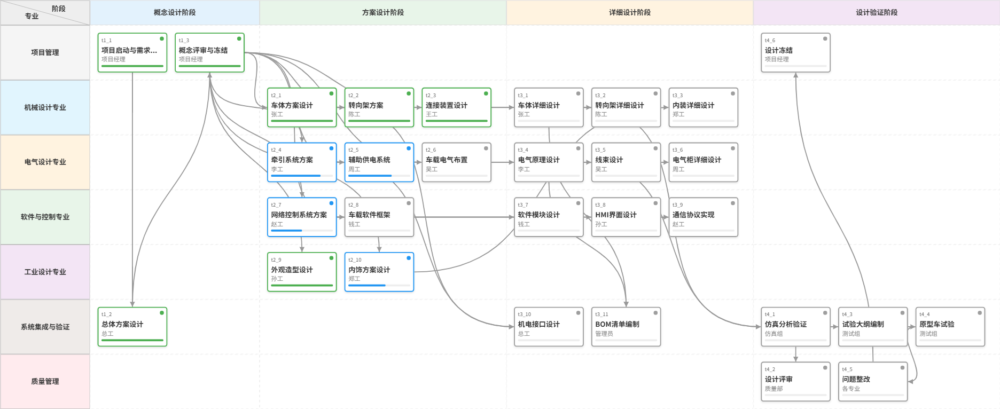

# Project Manager (PM)

一个基于 Vue 3 + TypeScript + Leafer UI 的可视化项目管理/甘特图工具。



## ✨ 特性

- **可视化画布**: 基于 [Leafer UI](https://www.leaferjs.com/) 的高性能 Canvas 渲染。
- **任务管理**: 支持创建、拖拽移动、调整任务进度。
- **泳道与阶段**: 支持水平泳道和垂直阶段划分，帮助组织任务。
- **依赖关系**: 支持任务间通过贝塞尔曲线建立依赖关系，支持自定义连接点位置。
- **交互丰富**:
    - 拖拽移动任务和连接点。
    - 缩放与平移画布（支持鼠标滚轮和手势）。
    - 键盘快捷键支持（Delete 删除，方向键微调）。
- **数据持久化**: 支持项目数据的 JSON 导入与导出。
- **导出功能**:
    - 导出为 PNG 图片。
    - 直接复制图片到剪贴板（需浏览器支持）。

## 🛠️ 技术栈

- **核心框架**: [Vue 3](https://vuejs.org/)
- **构建工具**: [Vite](https://vitejs.dev/)
- **语言**: [TypeScript](https://www.typescriptlang.org/)
- **状态管理**: [Pinia](https://pinia.vuejs.org/)
- **UI 组件库**: [Naive UI](https://www.naiveui.com/)
- **Canvas 引擎**: [Leafer UI](https://www.leaferjs.com/)

## 🚀 快速开始

### 安装依赖

```bash
npm install
```

### 启动开发服务器

```bash
npm run dev
```

### 构建生产版本

```bash
npm run build
```

## 📂 项目结构

```
src/
├── components/          # Vue 组件
│   ├── LeaferCanvas.vue    # 核心画布组件
│   ├── Controls.vue        # 顶部工具栏
│   ├── DetailPanel.vue     # 属性编辑面板
│   └── ...
├── stores/              # Pinia 状态管理
│   └── projectStore.ts     # 项目数据 Store
├── types/               # TypeScript 类型定义
├── App.vue              # 根组件
└── main.ts              # 入口文件
```

## 📝 操作指南

- **添加元素**: 使用顶部工具栏添加阶段、泳道或任务。
- **建立连线**: 从任务两侧的连接点（蓝色圆点）拖拽至另一个任务。
- **调整连接点**: 选中自定义连接点（绿色圆点）后，按住拖动可沿边缘移动；使用方向键可微调。
- **删除**: 选中任务、连线或连接点后，按 `Delete` 或 `Backspace` 键删除。
- **缩放**: 使用 `Ctrl + 滚轮` 或点击工具栏的缩放按钮；点击“适应画布”可自动调整视图。

## 🙏 特别鸣谢

本项目核心 Canvas 渲染引擎基于 [Leafer UI](https://www.leaferjs.com/) 开发。

感谢 [LeaferJS](https://github.com/leaferjs/ui) 团队提供如此优秀、高性能且易用的 Canvas 2D 渲染库。

- **Leafer UI 官网**: [https://www.leaferjs.com/](https://www.leaferjs.com/)
- **GitHub 仓库**: [https://github.com/leaferjs/ui](https://github.com/leaferjs/ui)
